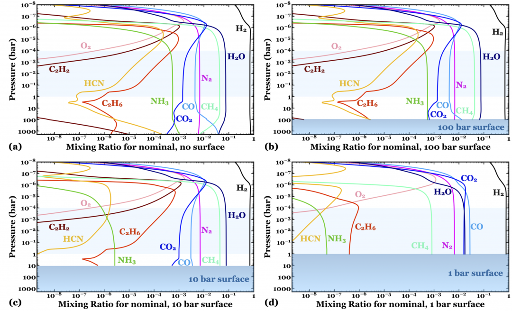
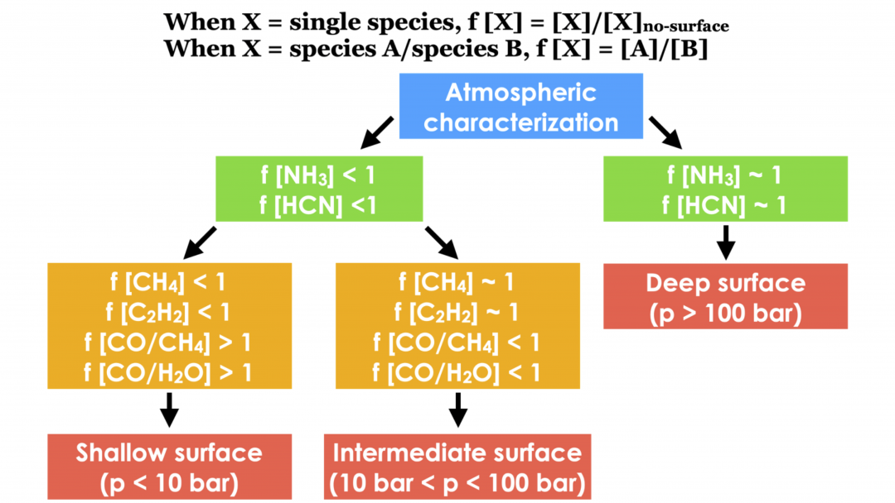

### Dec 2020

1. Why is the stratosphere isothermal?
   * At each layer of the atmosphere, in the optically thin limit, for uniform mixing ratios of atmospheric species and if heat transfer is only by radiation, the amount of IR emitted by the layer and the amount of sunlight absorbed by the layer are proportional to the mass of that layer.
2. The planets in the **single star** sample had a significantly higher occurrence rate outside of 1 AU than inside 1 AU by nearly 4σ, in line with expectations that **giant planets are most common near the snow line**. 
   1. However, the planets in the wide binary systems did not follow this distribution, but rather had **equivalent** occurrence rates interior and exterior to 1 AU. This may point to binary-mediated planet migration acting on our sample, even in binaries wider than 100 AU.

## Jan

1. Spin-Spin resonance explained by dumbbell model:
   1. It is only applied to the solid object.
   2. For the spin-spin resonance between Mercury and Sun, it depends more on the fluid viscosity of the star as Sun is a fluid object.

## Mar 

1. Why is the low-mean-molecular-mass atmosphere easier to be detected?
   1. H = RT/mg The lower the mean molecular mass is, the higher the scale height is, and therefore the more puffy the atmosphere is. With bigger size, there will be more transiting light and it will be easier to be detected.
   2. Detection of an Atmosphere on a Rocky Exoplanet-arXiv:2103.05657v1

#### [recent paper](https://arxiv.org/abs/2103.05449) on the formation of solid hydrogen interstellar objects

1. Why H2?

   1. It requires non-gravitational accretion
      1. -> constrain the surface area
      2. -> H2 is the best

2. Formation of H2 core:

   1. ~2.8K core
      1. Formed in molecue clouds.
   2. Energy balance (thermal condition) -> grain size
      1. Grain size matters: non-black body; the absorption coefficient 
   3. Dust -> hailstone -> snowball
   4. **Another thermal condition**: Heat from accretion does not melt the H2 core

3. Loss of H2

    

* Dust and Grain are colder towards the center in the molecue clouds
  * Magnetic press -- non-hydrostatic equilibrium

####  [this paper](https://arxiv.org/pdf/2104.09843.pdf) on identifying exoplanet surfaces using trace atmospheric species

###The New Generation Planetary Population Synthesis - Low mass stars

1. The planetary mass distribution does not linearly scale with the disk mass.

   --the ejection of smaller planets due to the giant planet

2. Earth-sized planets are most frequent around early M dwarfs(0.3-0.5)

###[ Water on hot rocky planets](http://geosci.uchicago.edu/~kite/doc/Kite_and_Schaefer_ApJL_2021.pdf)

1. Less H2/H2O fraction, more H2O in the magma. 

## Jun

#### 1D model Arxiv: 2105.08009v1 

1. Compare with the observation 

#### How to get gravitational potential parameters J?

* Observe the motion of the moons
  1. From the shade on the planet
  2. Transit a star

#### Stellar Rotation from TESS

 * Why stellar rotation matters?
   * Habitability: magnetic, irradiance... 
   * Measure the stellar age
 * Method
   * Training data:
     	* Simulation + true noise (TESS galaxy data)
   * Tool: Wavelet Power Spectrum 
   * Model: convolutional neural network

#### Core-powerd mass loss V.S. Photoevaporation 

* When stellar incident is fixed, will the gap change with stellar mass?
  * Core-powerd - No: only related to the toal flux
  * photoevaporation- Yes: depend on XUV photons, so stellar mass matters when bolometric flux is fixed.

#### Long-term transit duration changes -- Multiple planet system （https://arxiv.org/abs/2105.04318.）

* Observational bias -- positive relation between $\dot{T}_{dur}$ and orbital period :
  *  TDV detection requires $\dot{T}_{dur}>3 \sigma_{T_{dur}}$
  *  $\sigma_{T_{dur}}$ is higher when orbital period ($P$) is higher -- due to decreasing number of transits with longer orbital period.
 * Selection bias:
   * As the inclination variance will more easily lead to no transit for long-orbital-period exoplanets,
   * We are more likely to detect single transit planet at long orbital period.

#### GJ 1132b（ https://arxiv.org/abs/2105.10487.）

* Observational uncertainties:

  *  Uncertainties are a combination of the photon shot noise from the star, sky background, dark current, and read noises added in quadrature.

  *  charge-trapping ramps

     * Ramp effect is the most prominent systematics for WFC3/IR detector (as well as other HgCdTe based detectors) in the time-series observations. 

     * Inconsecutive  observation due to low orbit.

     * the detector stabilizes faster due to higher flux levels.

#### inner 10 au region rich in C?

*  C-H bonds (such as hydrogenated nano-diamond and amorphous carbon as well as polycyclic aromatic hydrocarbons (PAHs)), which generate infrared (IR) features that can be used to trace the solid carbon reservoirs.

#### TESS planets with 10~1000 AU (arxiv:2106.13354)

* A dearth of very closely separated binaries in systems which host exoplanets

* We do note that in exoplanet systems containing binary host stars, there is an observational bias against detecting Earth-size planet transits due to transit depth dilution caused by the companion star.
* The planet radii were estimated using the stellar radii from the TESS Input Catalog, which does not account for the multiplicity of the host stars and therefore could underestimate the radii of stars with bright, unresolved companions.

#### The magnetic field induced from an arbitrary, asymmetric ocean world (arxiv: 2106.10878)

* Any moon subjected to an oscillating magnetic field is a candidate for magnetic sounding
  * Liquid water oceans containing dissolved salts conduct electricity
  * -> Causing them to respond to oscillating fields that may be applied by their parent planet.
* **Why asymmetric? **: Close to the moon, induced magnetic moments of quadrupole and higher order will have their largest effect relative to the dominant dipole moments.
  * However, a spherically symmetric solution would predict only dipole moments are induced.

## Jul

### [identify exoplanet surfaces using atmospheric trace species in hydrogen-dominated atmospheres](https://arxiv.org/abs/2104.09843)

* Most common planets:
  * a giant terrestrial planet, with a solid surface and thin atmosphere (a “[super-Earth](https://exoplanets.nasa.gov/what-is-an-exoplanet/planet-types/super-earth/)”), 
  * or it may be more like a shrunken down version of the Solar System’s ice giants (a “[sub-Neptune](https://exoplanets.nasa.gov/what-is-an-exoplanet/planet-types/neptune-like/)”),

* NH3 (ammonia) on Jupiter/Titan:

  * Upper atmosphere:
    * Both Jupiter and titan are lack of NH3:
  * Lower atmosphere:
    * Jupiter: NH3 √ - the lack of a solid surface means the constituent parts of NH3 are transported into the hot, high pressure lower atmosphere where they can reform into ammonia via thermochemical reactions 
    * Titan: NH3 x - Titan’s surface prevents its atmosphere from reaching high enough temperatures and pressures for the recycling reactions to occur. Titan instead has a larger abundance of nitrogen, leftover from the destroyed NH3. 

* K2-18b:

  * a shallow surface-> 
    * the atmosphere is never hot enough for thermochemical reactions to take place, meaning the abundances of photochemically fragile species such as ammonia decrease.
    * For the shallowest, Earth-like surfaces, thermochemistry is prevented for the majority of species, and the atmosphere is now also depleted in water (H2O) and methane (CH4).
  * No surface/Deep surface ->
    *  hot enough for thermochemical reactions to produce fragile species such as ammonia (NH3).
    * large amounts of hydrocarbons and nitrites such as hydrogen cyanide (HCN) are produced.
  * 

* How to use it?

  

* Discussion:
  * The current study also does not consider the potential impacts of processes that occur *on* the surface, such as [volcanic activity](https://astrobites.org/2017/03/08/a-volcanic-hydrogen-habitable-zone/) and [reactions with oceans or rocks](https://astrobites.org/2021/04/08/water-on-rocky-exoplanets/), or the potential [escape of gases](https://astrobites.org/2018/06/14/deflating_a_planet_helium_loss_in_wasp_107b/) from the top of the atmosphere

### Space phenomena and plasma environment(arxiv: 2107.00585)

*  during times of low solar activity, modest space weather phenomena may cause large variations of plasma flow at Mars.

### Reflected light spectra -> Direct imaging

* Simulations of exoplanet albedo profiles -> future direct imaging observations
* Points:
  * Spectra Method:  Enables calculations of disk-integrated spectra one order of magnitude faster than Chebyshev-Gauss sampling for moderate- to high-resolution sampling.
  * Atmosphere model:
    * First-principle (**Why is it first-principle?**)
    * include versions with different **haze** and **cloud** properties.

* Cloud trick:
  * Cloud extent was chosen based upon intersections of T/P profiles with condensation curves

### Mutual inclination arising from stellar quadrupole moment([arXiv:2107.00044](https://arxiv.org/abs/2107.00044))

* Single planet with high inclination
  * Explanation: arising from stellar quadrupole moment
    * Arsing from during its early phase of rapid rotation, coupled with a non-zero stellar obliquity.
*  approximately 5-10% of low-mass Kepler systems are susceptible to this instability mechanism
  * -> truly single

### Planetesimal and Embryo Formation( [arXiv:2107.00380](https://arxiv.org/abs/2107.00380) )

* Starting stage:

  *  pebbles becoming trapped in short-lived pressure bumps

* Environment: thermally evolving viscous discs

* Conclusion: 

  1. Planetesimal sizes increase with orbital distance, from ∼10 km close to the star to hundreds of kilometres further away.

  2. Proto-embryo masses are also found to increase with orbital radius, ranging from 10−6 M⊕ around the iceline, to 10−3 M⊕ near the orbit of Pluto.

     

  * Explanation:
    * Interior to iceline:
      * Planetesimal accretion -> efficient <- small planetesimal size
      *  pebble accretion is 
        * -> efficient where pebble sizes are fragmentation limited
        * -> inefficient when drift dominated due to low accretion rates before the pebble supply diminishes.
    * Exterior to the iceline
      *  planetesimal -> inefficient <-due to increasing planetesimal eccentricities.
      * pebble accretion -> efficient 
        * -> the initial proto-embryo masses increase, allowing them to significantly grow before the pebble supply is depleted.
    *  Combining both scenarios allows for more massive proto-embryos at larger distances, since the accretion of planetesimals allows pebble accretion to become more efficient, allowing giant planet cores to form at distances up to 10 au.

### [asteroid shape's role on white dwarf debris](https://arxiv.org/pdf/2107.00322.pdf)

* Description: Here we present an analytical framework to identify the type of disruption (tidal fragmentation, total sublimation or direct impact) experienced by triaxial asteroids approaching white dwarfs on extremely eccentric (𝑒 ∼ 1) orbits.

* Conclusion: higher temperatures sublimate large elongated asteroids, and cooler temperatures accommodate more direct impacts.

### planet around T Tauri star (arxiv:107.02265)

* The planet’s close separation raises the possibility that its orbital motion could perturb the star’s magnetic field structure and **induce flares** through tidal effects or star-planet magnetic interaction.
  * mostly main-sequence G-M exoplanet host stars by Poppenhaeger et al. (2010) found no conclusive evidence for effects on coronal X-ray emission due to planet-star interaction
  * T Tauri stars tend to be much more magnetically-active and X-ray luminous than older late-type main-sequence stars

### Predicting Hidden Companions for Known Planetary Systems (arxiv: 2107.07529)

* (Planet1,2 )+Outer planet(Planet_out)
  * Three mechanism:
    1. EKL (Eccentric Kozai-Lidov Effect) mechanism -> **unstable**: EKL oscillation to excite the eccentricity of the inner planet.
    2. Laplace Lagrange mechanism -> **stable**: exchange angular momentum *between the inner planets*, can suppress the outer companion’s (2) induced eccentricity excitation.
    3. General Relativity -> **stable**: To suppress the eccentricity of inner planets(1,2).
  * To determine if GR take place:
    * $\tau_{GR}<\tau_{LL}$
      * $a_1^2/a_2$ V.S. $M^2/m_1 \sim (e_{max})$
      * $e_{max}$quadrupole-level, EKL oscillation
      * Given of $e_{max}$, the parameter space can be determined.
    *  if $e_{max}$ is high, GR is making a significant contribution to the stability of a non-negligible portion of the parameter space.
* (Planet1,2 )+Inner planet(Planet_in)
  * Three mechanism:
    * Laplace Lagrange mechanism -> **unstable**: to excite the eccentricity of planet_in ~0.4.
    * Laplace Lagrange resonance -> **unstable**: to excite the eccentricity of planet_in ~ higher.
    * General Relativity -> **stable**: To suppress the eccentricity of inner planets(Planet_in).

### Planet Migration in precessing disk with S-type Binary (arxiv: 2107.06832)

* Precessing disk:
  * approximate formulas for the evolution of the disk’s inclination and longitude of the ascending node
  * rigidly precessing disk with a decreasing mass
  * perturbed by a wide *binary companion*.
* Planet:
  * +disk gravitational potential acting on the planet 
  * +nodal precession induced by the wide binary 
  * +Lidov-Kozai perturbations
  * How they affect the migrating giant planet.

### [Radioactive Planet Formation and it's influence](https://arxiv.org/pdf/2107.03329.pdf)

* Where
  * Cosmic rays are accelerated near the inner truncation radii of circumstellar disks, $r \sim 0.1 AU$​, where intense magnetic activity takes place.

* How strong?
  *  can be enhanced over the values inferred for the early solar system (from meteoritic measurements) by factors of ∼ 10−20. 
* Influences:
  * Planet formation
    * The minimum size required for planetesimals to become fully molten decreases 
    *  leads to **loss of volatile** components including water. 
  * Planet's properties
    *  have significant internal luminosity which can be comparable to that provided by the host star;
    * this additional heating affects both atmospheric mass loss and chemical composition
* Why important?
  * **Red Dwarfs** : habitable zone is coincident with the magnetic reconnection region.
  * ->planet forming in this regime will experience maximum exposure to particle radiation, and **subsequent depletion of volatiles**.

### [Ultra-Short-Period Planets and FU Ori Outbursts](https://arxiv.org/pdf/2107.03413.pdf)

* What is it?
  * Ultra-short-period (USP) planets reside inside the expected truncation radius for typical T Tauri disks
* Why is it important?
  * standard disk migration or in situ formation cannot explain.
    * Because type-1 torques vanish or switch direction when a planet migrates close to the disk’s inner truncation radius
  * New explanation
    *  The magnetically-driven sub-Keplerian gas flow -- provides a headwind to small planets
      * -> overcome type-1 torque 
    * FU Ori outburst -- moves the disk truncation radius inward

### Relevant / Important / Useful

### Interesting / Keep in mind
### Others
