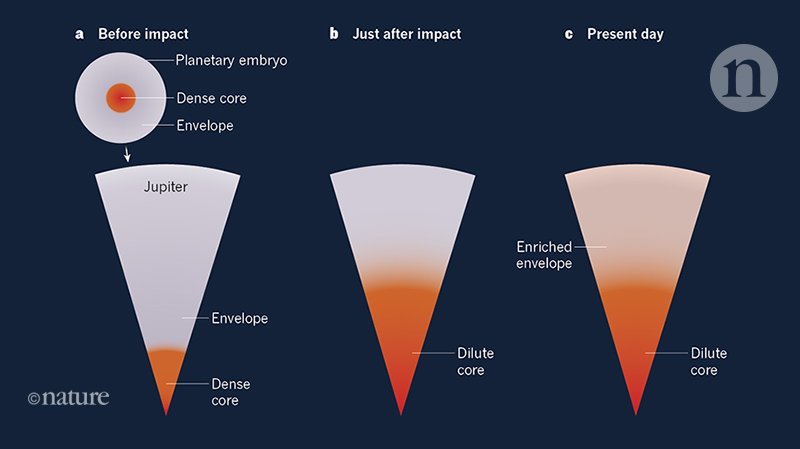

## Jan 2022

### Analytical Modelling of Exoplanet Transit Specroscopy with Dimensional Analysis and Symbolic Regression

* the use of dimensional analysis to identify the relevant combinations of physical parameters (the so-called Pi
groups Barenblatt (1996)) which uniquely determine the observed transit spectra. 
* Input Pi an then the use **symbolic regression** to derive
accurate analytical formulas representative of a typical forward model

### Timeline of formation of solar system

### The relation between tectonics and habitability:

Planets without such plates are known as stagnant lid planets, coping with a crust made up of a single spherical plate floating on the mantle. Should we rule out such planets as candidates for life?

Penn State’s Foley, cited above, has been working with colleague Andrew Smye on computer models that probe the idea. The scientists wanted to learn whether climate regulation through chemical weathering could be sustained on a stagnant lid planet,a place where there is no subduction and the recycling of surface material back into the mantle would be limited. On such a world, the development of continents and their productive collisions would not occur, although as the paper points out, volcanism can still release some mantle CO2 to the atmosphere, allowing for at least some degree of surface recycling through lava flows.

### Why high-O2 is not a bio signal？

The early development of abiotic, oxygen-rich atmospheres could prevent the subsequent emergence of life by precluding prebiotic chemistry (Wordsworth et al., 2018). It has also been argued that the spectral energy distributions of M-dwarfs are favorable for the photochemical accumulation of O2 and O3.

### KBO:

* Kuiper belt:
	- the Kuiper belt is a relatively "round" and "flat" doughnut of space extending from about 30 AU to 44 AU with its member-objects locked in autonomously **circular** orbits ( cubewanos) or mildly-elliptical resonant orbits ( plutinos and twotinos)
	- Two populations:
		+ the **classical** Kuiper-belt objects (or "cubewanos"), which lie in orbits untouched by Neptune
		+ the **resonant** Kuiper-belt objects; those which Neptune has locked into a precise orbital ratio
* Scattered disc: 
	- Kuiper Belt Objects (KBOs) with large orbital eccentricities and inclinations. They have perihelia between 30 and 48 AU, aphelia greater than 60 AU, and were probably flung into their current orbits during the early Solar System through gravitational interactions with the giant planets.

### arxiv; 2201.05311: a a local Hubble expansion can explain the large mean recession speed of Titan from Saturn

* The formal explanation: 惯性波的频率和tidal 频率一致时共振：https://www.nature.com/articles/s41550-020-1120-5 

### Ohmic dissipation:

* Giant planet：
	- Effects: Hot-Jupiter radius inflation
	- Model: 要求内部大气极高温，电离一部分金属气体，外层大气低温作为 insulating shells. 然后欧姆耗散发生在10-0.03bar的大气里。
* Rocky planet:
	- The atmosphere is not hot enough to ionize the gas, so there should not be ohmic dissipation.
	- 高层大气有，但是由于气体稀薄，不会很强。（体积、电导率来估算）
	- Mantle is not or weal conductive, so there is no Ohmic dissipation in mantle.
	

### Dilute core

### Origins of hot Jupiter:

	* Migration
	* Scattering. One is scattered to outer space, the other one left and is scattered to an eccentric orbit. It will move to a as the perihelion. 

## Feb

### Thermal Processing of Solids Encountering a Young Jovian Core

* More massive core -> larger radius envelope -> cooler accretion environment -> the pebble is more likely to remain N2.

### Planetesimal rings as the cause of the Solar System's planetary architecture

* Chondrite VS Solar abundance
  * Li: it is easier to be escaped from the sun with time
  * O, C, N: the volatile escape from chondrite
* Subclass
  * Carbonaceous chondrites(CC): 
  * NonCarbonaceous chondrites(NC): more consistent with rocky planet
* Jupiter can act as a barrier to block off the migration and mixing of CC and NC

* Rather than a continuous distribution, planetesimals pile up in three different locations. It is because the snowlines of different volatiles migrate inward as the disk cools, leaving a band of planetesimals.

  

### Migration traps as the root cause of the Kepler dichotomy (https://arxiv.org/pdf/2202.05342.pdf)

* Kepler dichotomy: Considering the detection bias, the observational data suggests that roughly 50% of all systems have just one planet (including non-transiting ones) and 50% have many planets (5+ for small stars).
* Previous explanation:
* This paper:
  * high-mass systems: 
    * migrate rapidly 
    * **Inner: ** more planets into orbital periods of less than 200 days.  -> **Dynamically cold** ->  low mutual $i$ and a higher probability of detecting multiple transiting planets
    * **Outer** : caught in a migration trap — a range of planet masses and locations in which a dominant co-rotation torque prevents inward migration
  * Low-mass systems: 
    * **Inner:**  ***fewer*** planets inside 200 days -> **Dynamically hot** -> leading to collisions and high mutual $i$.
      * Fewer is the leading order, low mutual inclinations are lower order.

## Mar

### Bertaux & Ivanova: A numerical inversion of 𝑚 sin 𝑖 exoplanet distribution: the sub-Saturn desert is more depleted than observed and hint of a Uranus mass gap

* True mass retrieved.
* Cliff: 0.1-0.2 M_Jup (32-64 M_Earth)
* Sub-gap for lighter planets: 13.7 to 15.2 𝑀⊕ containing Uranus

### Weiss et al, 2022: Architectures of Compact Multi-planet Systems: Diversity and Uniformity

* Uniformity: equal size, regular orbital spacing, low eccentricity, and small mutual inclination 

* [Jeans Mass](http://icc.dur.ac.uk/~tt/Lectures/Galaxies/TeX/lec/node37.html#:~:text=The%20Jeans%20mass%20is%20the,re%2Dexpand%20when%20being%20compresses.): The critical mass above which **gravity dominates**. For perturbations below the Jeans mass, pressure forces dominate, and so the perturbation will re-expand when being compresses. But for perturbation more massive than the Jeans mass, gravity dominates, and so a perturbation will collapse even further when compressed, leading to **run-away collapse**. 
* [Insolation Mass](http://astro.vaporia.com/start/isolationmass.html): The mass to which accretion slows and virtually ceases. About moon size to Mars size

### Krijt: Chemical Habitability: Supply and Retention of Life’s Essential Elements During Planet Formation

* Life elements: CHNOPS
* Abiotic CHNOPS fluxes on mature rocky worlds.
* 

* Modern planet formation theory provides an unbroken chain of processes connecting nebular dust and gas (bottom left quadrant), through pebbles and planetesimals
* 

* Two scenarios of planet formation and its consequence on CHNOPS
  * Cold disk + quiet star cluster: 
    * planetesimal formation occurs at major snowlines
    * Volatile-rich Embryos
    * Migrate
    * Resonant chain 
    * Different distance and corresponding geological process lead to different types
  * Warm disk + high metallicity+abundant short-lived radionuclides (SLR)
    * planetesimal formation throughout the disk
    * giant planets causes substructure
      * fossilizes the water snowline
      * shuts off the radial pebble flux 
    * Volatile-poor Embryos
    *  may still acquire CHNOPS later on during externally triggered instability and late veneer-like event.

### Lichtenberg et al, 2022: Geophysical Evolution During Rocky Planet Formation

* Timeline of core formation, mantle crystallization, silicate differentiation, and crust formation inferred from geochemically-dated samples

  * Age is reference to CAI
  * CAIs: the first solids condensed from the cooling protoplanetary disk. Its age is used to defined the birth of solar system.

  

### Reggiani et al 2022: Evidence that the Hot Jupiter WASP-77 A b Formed Beyond Its Parent Protoplanetary Disk's H2O Ice Line

* Takeaway: The comparison of C/H abundance and ratio can indicate the formation region of a planet

### Ambrifi et al, 2022: The impact of AGN outflows on the surface habitability of terrestrial planets in the Milky Way

* Mechanisms:
  * heat atmospheres and drive atmospheric escape
    * Heat causes hydrodynamical escape
    * Energy-limited hydrodynamic escape (caused by EUV)
  * the formation of nitrogen oxides and thence cause ozone depletion
