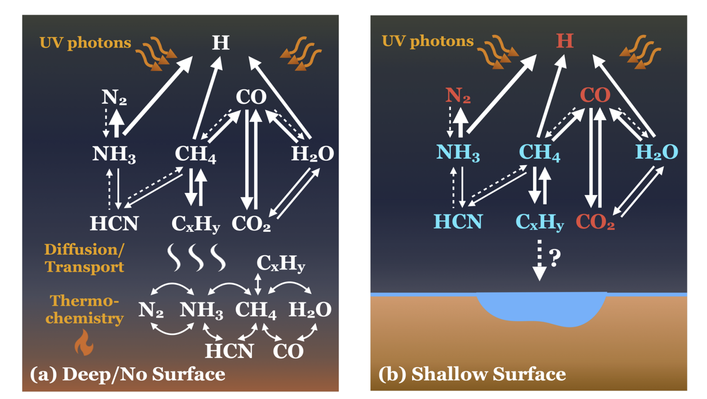
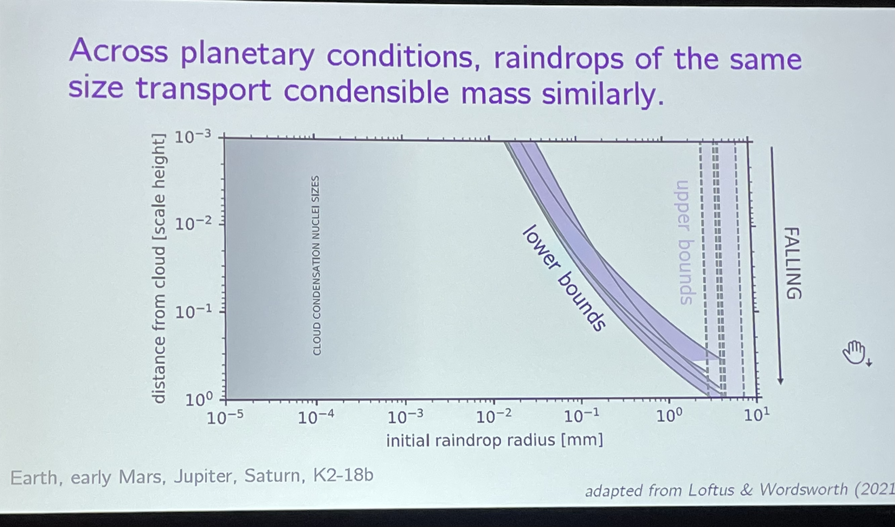

### Notes:

* Planetary science: Subsurface habitable environment and how it links to the surface?
* Triptych of climate
  - To develop a whole set of parameters to determine HZ.

### Monday

## 1. U12A: Inversion and Uncertainty Quantification in the Geosciences

### A. MCMC and High Order Derivative Tensor Trains

1. Approximate parameter-to-observable map -> high order Taylor series
   * Jacobian ($\frac{df}{dx}$) + higher derivative terms ($\frac{d^nf}{dx^n} n =2,3,...$)
   * If the nonlinear is strong -> higher derivative terms matters
2. "Tensor-free" tensor free
   *  $\frac{df}{dx}$ Matrix; $\frac{d^2f}{dx^2}$ -3 tensor; $\frac{d^3f}{dx^3}$- 4 tensor; ...
   * Reduce the n-order tensor to a series of 3-tensor
3. Can be applied to inverse problem
4. **Take Away**:
   * Riemannian manifold MCMC (RMHMC) can achieve high acceptance rates and large step sizes for non-Gaussian posteriors by incorporating information from high order derivative tensors.
   * "tensor-free'' tensor train compression can trace it.

### B. Greedy Multi-scale Surrogates for Uncertainty Quantification

* Usage; 
  * It greedily learns the structure of the underlying physics using a sparsity constraint that is shown to promote modeling stability.
* Advantages:
  * Not like kernel-driven Gaussian process, this method only need one hyper parameter.

## 2. Search for habitable conditions in the outer solar system

* The habitable zone may be larger than originally conceived. The strong gravitational pull caused by the giant planets may produce enough energy to sufficiently heat the cores of orbiting icy moons. This could mean that some of the strongest candidates for harbouring extraterrestrial life are located outside the solar habitable zone, on satellites of Jupiter and Saturn. 
* Saturn
  * Titan - dune world 
    * Rainstorm?
    * Surface has strong latitude-dependency:
      * Three different albedo
    * Active chemistry
  * Enceladus
    * Heat Source?
    * Plume:
      * Saturn's small, icy moon Enceladus captured the imaginations of people worldwide when NASA's Cassini spacecraft saw it spewing plumes of water into space. This water comes from a global, liquid ocean concealed beneath Enceladus' fissured crust

### Tuesday

## 1. Aquaplanetology: Aqueous Environments and Habitability in the Solar System

### B. The Great Oxidation Event (GOE) on Early Mars

* Background
  * Early Mars: Warm, greenhouse effect
  * ↓reducing? Great Oxidation?
  * Modern Mars: poor atmos
* Fe loss indicates the great oxidation

### D. Glaciovolcanism

* **Glaciovolcanism** is [volcanism](https://en.wikipedia.org/wiki/Volcanism) and related phenomena associated with glacial ice. The ice commonly constrains the erupted material and melts to create [meltwater](https://en.wikipedia.org/wiki/Meltwater). Considerable melting of glacial ice can create massive [lahars](https://en.wikipedia.org/wiki/Lahar) and glacial outburst [floods](https://en.wikipedia.org/wiki/Flood) known as [jökulhlaups](https://en.wikipedia.org/wiki/Jökulhlaup).

### E. Subsurface: Ground Water on Mars:

* Habitable: 
  * Block the harmful radiation
  * water
* N-cycle? -- 
  * Energy source for life?
* The link between subsurface and easily-observable surface

### G. Selective oxidation on Europa’s surface: Insights for supply of oxidants into the subsurface ocean

* Chlorine: 氯
* Europa:
  * H2O dissociation -> H2 escape -> O2 oxidate
* Redox: 氧化还原
* Redox disequilibrium:
  * Energy source for life  

### H. Hypothetical Habitability of Enceladus

* Elements in the plume:
  * H2, CH4, CO2
* Potential biotic reaction
  * 4H2+Co2 -> CH4+2H2O
* **Methanogens** are microorganisms that produce [methane](https://en.wikipedia.org/wiki/Methane) as a [metabolic](https://en.wikipedia.org/wiki/Metabolism) byproduct in [hypoxic](https://en.wikipedia.org/wiki/Hypoxia_(environmental)) conditions. 
  * Hypoxic: low exgen

## 2. Atmospheric Convection: Processes, Dynamics, and Links to Weather and Climate III

 * convective self-aggregation
   - Convective self-aggregation is the spontaneous spatial organization of convection in numerical simulations of radiative-convective equilibrium despite
   homogeneous boundary conditions and forcing. This instability of the RCE
   state arises due to interactions among convection, radiation, environmental
   moisture, and surface fluxes.
 * Red noise:
   - The term "red noise" comes from the "white noise"/"white light" analogy; red noise is strong in longer wavelengths, similar to the red end of the visible spectrum.

### B. Zeyuan Hu

* The finer resolution leads to higher ice fraction.

### D. Size distribution of tropical clouds; Timothy Garrett

* Theoretical prediction: Power law with index = -1
  - Consistent with the simulation
* Observation?
  - Satellite-dependency: don't know why

## 3. General Session: Atmospheric Dynamics and Climate I Oral

### D. Energy Export from the Nino3.4 region via the Atmosphere – a Lagrangian Perspective

* Lagrangian mechanic 
	* Trace the particles 30 days forward 
	* distinguish the particles and environment

### E. The Basic Nature of Atmospheric Scale interactions and Scale-Dependent Predictability

* Two questions 
	* Which one determine the energy spectrum of atmosphere
		* Turbulence or Wave?
	* power law with what index?
		* 3 or 5/3?
* Answers 
	* 

### F Temporal merging of decadal predictions and climate projections to obtain seamless information: challenges and potential solutions

* Question: predicted weather using climate model
	* work better in 
		* colder temperatures 
		* lower eddy grow rate

### G. Revisiting the Role of Mountains in the Northern Hemisphere Winter Atmospheric Circulation

* Mountains: orography
* What if Earth rotate backward 
	* The influence will be different!
		* wind forcing is different

## 4. A24D: General Session: Atmospheric Dynamics and Climate II Oral

### C. Seasonal Delay of Tropical Rainfall
* GHG forcing weakens the delay
* Aerosol forcing enhance the delay

### D. "Dry get Wetter" paradigm in China
* Caused by the horizontal and vertical moisture.

### H. The midlatitude response to polar sea ice loss and melting: Idealized slab-ocean aquaplanet experiments with thermodynamic sea ice
* The sea ice loss weakens the mid-latitude circulation
  - Larger Extent -> more weakening 
  -  Deeper mixed layer -> more weakening
  -  Explanation: More mean avaliable potential energy
  
* an energetic mechanism of weakening of the storm track in response to sea ice loss.
  - sea ice loss increases the absorption of shortwave radiation by the surface
      *  (due to the decrease of surface albedo)
  -  absorption of radiation drives an increase in surface turbulent fluxes into the atmosphere 
  -  more energy in atmosphere weaken poleward atmospheric energy transport. 
    +  The storm track weakens because it dominates poleward energy transport.
    

### Wednesday

## 1. Processes in the Present-Day Atmosphere of Mars II Oral

### E. Mars’ Emitted Energy Using MGS/TES Observations

+ Strong seasonal and diurnal variation
+ The dust storm may explain the radiant energy imbalance --- it is unlikely the seasonal variations in absorbed solar power will match the seasonal variations of emitted energy
  

### F. Modeling the B Regional Dust Storm on Mars

+ The annually-recurring, regional B storm on Mars occurs at the highest southernlatitudes in years lacking a global dust storm (GDS), and produces warm temperatures (> 200 K) at 50 Pa over the south pole. 
  * Lofting mechanism: episodic dust plume
    - Cause: Topographical variation? Cap-edge variation? The CO2 sublimation flow.
    

### Thursday

## P42A: Atmospheric Dynamics and Astro/Geophysical Modeling Studies of Habitable Ocean Worlds, Moons, and Atmospheres Near and Far I Oral

### A. Recent Progress and a Near-Future Vision for Exoplanet Atmospheric Dynamics

* Review about gas giant 3D simulation
* Problems with current 3D simulation
  - 1 Physical processes
    + Clouds micro physics 
      * Day-night contrast
      * Fp/Fs
    + Magnetic effects
      * 
  - 2 Numerical set-up
  - 3 Intrinsic diversity 
* Solution
  - 1,2 -> better data, greater precision to disambiguate
  - 3 -> population studies can evaluate, precision can give individual details

### B. The importance of the “in-betweens”

* Triptych of climate
  * Earth:
     * Ocean
     + Moist atm
     + Fast rotation
  - Mars:
     + Land 
     + Dry atm
     + Fast rotation
  - Venus:
     + Land
     + Dry atm
     + Slow rotation
  - Titan:
     + Sea
     + Dry atm
     + Slow rotation
  

**Climate transition At The Boundary**

* Earth -> Titan
  - Only three parameter need to be modeled
    + Equatorial land width
    + Rotational speed
    + Atmosphere volatile
  - Titan-climate 3 criteria
    + ConVQ: constant 
    + OffEq: high specif humidity is off equatorial 
    + Dry air (RH<50%) at equatorial.
    

### C.Circulation cells in the meridional plane of Jupiter: Breaking waves produce upside-down analogs of the Brewer Dobson circulation in Earth’s stratosphere

* On Earth
  - upwelling at zone and downwelling at belt
  - Small AM transported up from troposphere 
  - thermal wind requires lower temperature at equatorial
* No solid surface? -> Giant
* Inverse it

### D. Looking for water in Jupiter’s atmosphere: Adam Showman’s legacy and Juno measurements

* Galileo probe abundance profiles (**Hot Spot**) is evidence for a dry downdraft 
  - How to keep downdraft dry to 20 bar
  - Why NH3 is abundant before H2S
  - How to let dry air down to 20 bar
* **Q: Is the same mechanism as the last talk?**

### E. How to identify exoplanet surfaces: without seeing them?

* Main Idea:
  -  
* Main Conclusion:
  - 

### F. Explicit Atmospheric Convection and the Climate and Habitability of Tidally Locked Planets --Jun Yang

* West-east asymmetry 
* Clouds from substellar point:
  + Strong, dense clouds from substellar point -> east-west asymmetry
  + Stable Feedback: Albedo increases when considered clouds
  + Differs from models
* Model choice: SAM, ExoCAM, CAM4
  

### G. Dynamics of a QBO-Like Phenomenon on a Tidally Locked Planet

* QBO: The quasi-biennial oscillation
  - The quasi-biennial oscillation (QBO) is a quasiperiodic oscillation of the equatorial zonal wind between easterlies and westerlies in the tropical stratosphere with a mean period of 28 to 29 months.
* **Q: The mechanism of QBO**

### H. Observations of Gravity Waves in Saturn’s Thermosphere and Implications for Meridional Circulation

* Gravity wave is strong at thermosphere > mesosphere > stratosphere > troposphere
* **Q: Is it true?**
* The breaking and dissipating gravity wave transfer energy to the mean flow
* Wave drag could explain the slight aurora-equator contrast
  - Enhance the meridional transport

### I. The Physics of Falling Raindrops in Diverse Planetary Atmospheres: How the Simplicity of Raindrops Can Constrain Condensible Cycles

* Raindrop size determines its fate after leaving the cloud
* Raindrop of the same size transport condensible mass similarly.

## 2. P43B: Titan: Atmosphere, Surface, and Interior I Oral

### A. Topography and Tectonic Stresses Induced by Heat Flux from Titan's Ocean.

* Motivation: Polar depression
  - caused by:
    + Atmospheric processes
    + ocean dynamics
  - The heat flux can cause different topography
    + convective or conductive

## 3. Cool Stars and Their Influence on (Exo)Planetary Habitability II Oral

### E. Which Terrestrial Exoplanets Deserve More Scrutiny for Atmosphere Viability?

### F. The 3D Effects of Large Stellar Flares on Habitable Zone Planets (invited)

* The effect of flare associated chemistry on climate

### Friday

### B. Suppression of Baroclinic Eddies by Strong Jets

